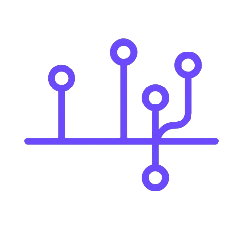

<h1 align="center">
  
  <br>
  Technology Genealogy
</h1>

A web application that visualizes the genealogy of technology using D3.js and Flask. The project displays a timeline of technological events in an interactive tree format with clickable nodes for more information.

## Features

- **Interactive Tree Visualization:** Visualize events in technology history laid out in a tree structure.
- **Clickable Nodes:** Click on a node to open its related Wikipedia page.
- **Zoom and Pan:** Use mouse scroll and drag to zoom in/out and pan across the visualization.
- **Responsive Design:** The visualization scales to fill the browser window.

## Project Structure

```
tech-genealogy/
├── app.py              # Flask application
├── templates/
│   └── index.html      # Main HTML file
├── static/
│   ├── css/
│   │   └── styles.css  # CSS styling for the project
│   ├── js/
│   │   └── tree.js     # D3.js script for rendering the tree visualization
│   └── data/
│       └── events.json # JSON data for technology events
└── README.md           # Project documentation (this file)
```

## Requirements

- Python 3.x
- Flask
- livereload
- D3.js (loaded via CDN in the HTML)

## Setup and Running the Project

1. **Install Python dependencies:**  
   Open your terminal and run:
   ```bash
   pip install Flask livereload
   ```

2. **Run the Application:**  
   From the project root directory, run:
   ```bash
   python app.py
   ```
   The server will start and serve the app at [http://127.0.0.1:5500](http://127.0.0.1:5500).

3. **View in Browser:**  
   Open your web browser and navigate to [http://127.0.0.1:5500](http://127.0.0.1:5500) to see the interactive technology genealogy tree.

## Customization

- **Data:**  
  Update `static/data/events.json` to modify or add new technology event nodes.

- **Styling:**  
  Adjust the styles in `static/css/styles.css` to customize the look and feel of the visualization.

- **Visualization:**  
  The tree layout is rendered by `static/js/tree.js`. Tweak the D3.js code (e.g., spacing, zoom settings) to customize the visualization.

## License

This project is open source.

## Acknowledgments

- [D3.js](https://d3js.org/) for providing the powerful data visualization library.
- [Flask](https://flask.palletsprojects.com/) for making it easy to create lightweight web applications.
- Wikimedia and Wikipedia for the inspiration behind technology event data.

